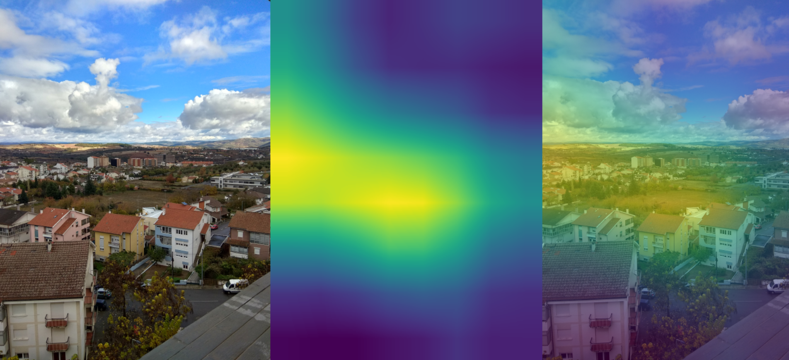

# tf2cam
Tensorflow 2.0 CAM (Class Activation Maps) - Visualization for CNN models using h5 model files
#

# Params:

  - -i   Path to Image

  - -m   Path to h5 model file

  - -s   Input Size of the model ie: 299, 224, 160 

# Example:

python gradcam.py -m model.h5 -i picture.jpg -s 299

# Result:

